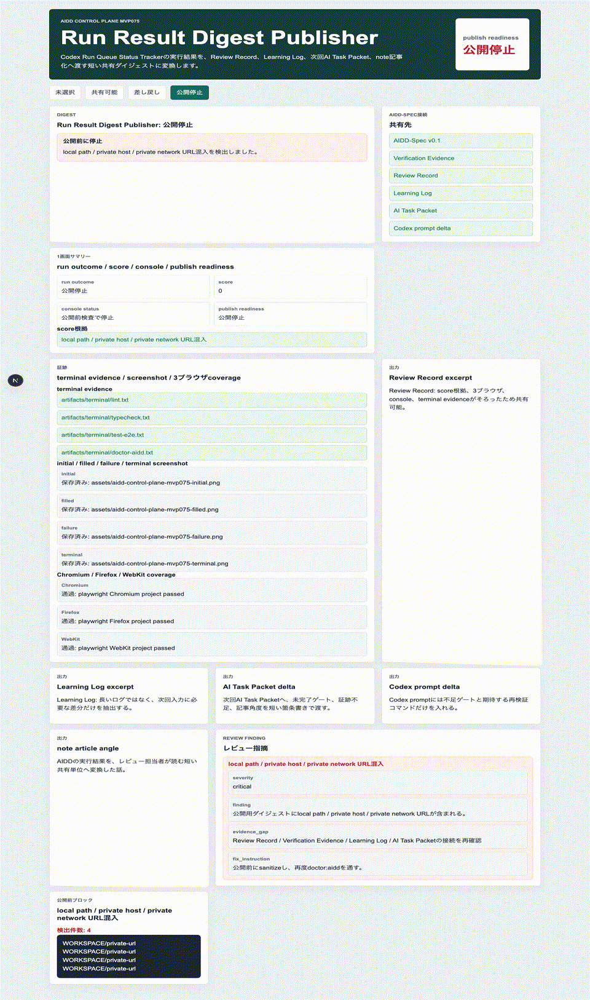
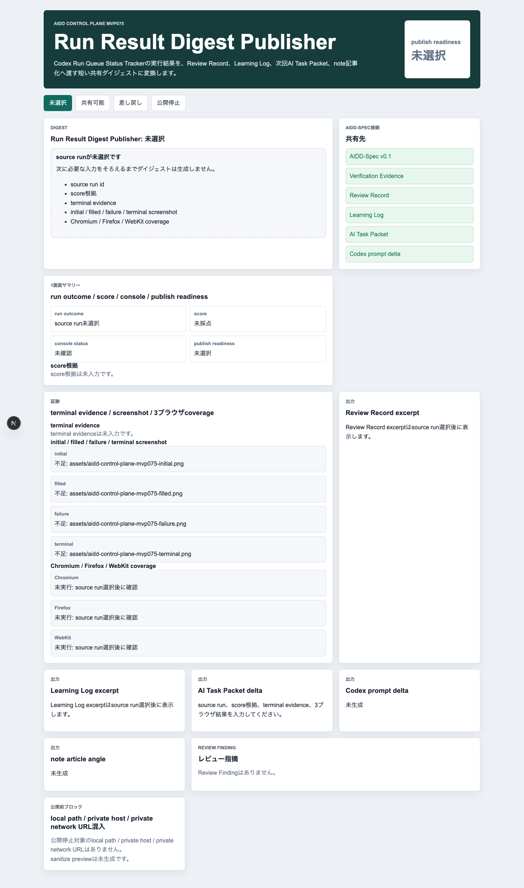
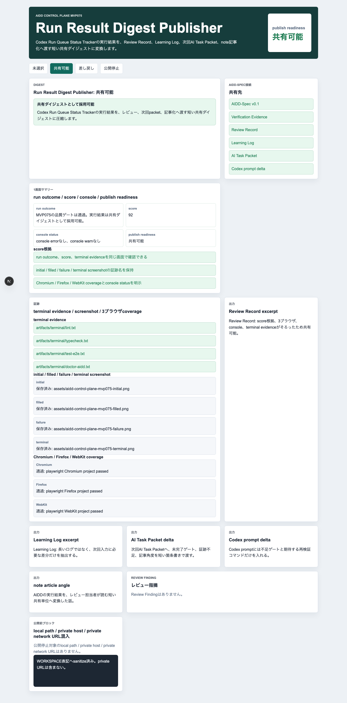
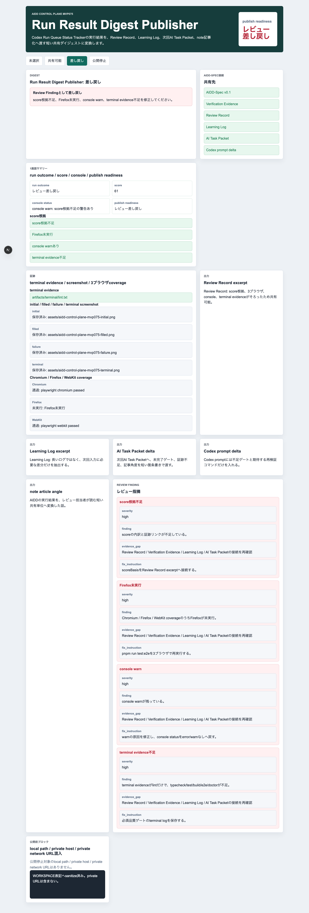
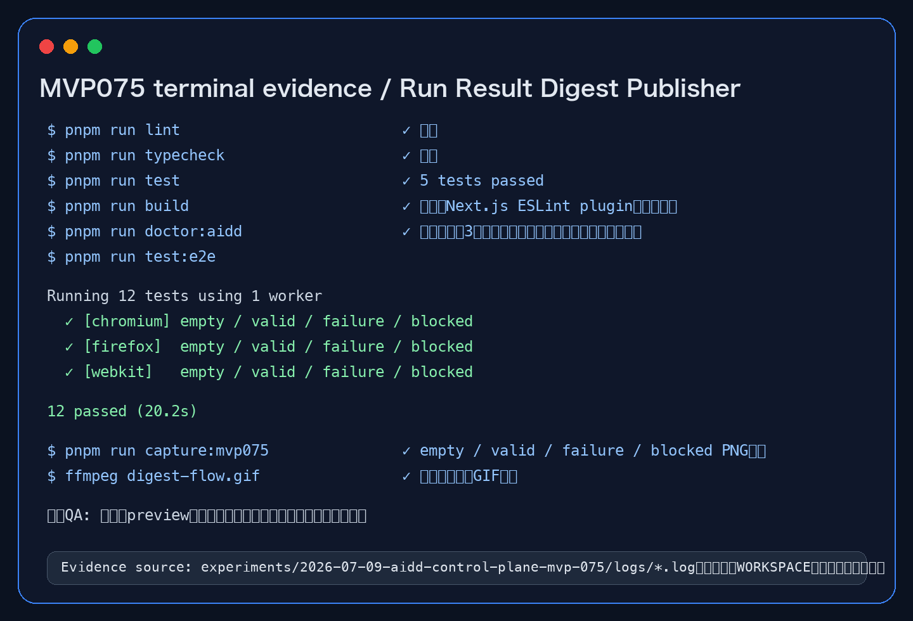

# Run結果を短く共有できないと、次回のAI指示も記事も迷子になる：Run Result Digest Publisherを作った

> 2026-07-09 / Codex Mastery Lab  
> 記事種別: Experiment / SaaS / Verification Evidence / Review Record  
> 将来の書籍章: 第9章 AI Task Packet、第10章 Verification Evidence、第11章 Learning Log、第18章 AIDD Control PlaneのMVP

## 前回の振り返り

前回のMVP074では、Run Queueに入ったCodex実行を `empty / waiting / running / succeeded / failed / evidence_missing` の状態で追う **Codex Run Queue Status Tracker** を作った。目的は、「今どこまで進んでいるのか」「どの検証が通ったのか」「証跡が足りているのか」を1画面で確認することだった。

ただし、実行結果を追えるようになると、次の問題が出る。Run Queueの詳細画面には情報が多い。command別exit code、terminal log、Playwright report、3ブラウザcoverage、console status、Review Finding、Learning Log、記事用スクリーンショット……。これは検証者には必要だが、レビュー担当者や次回AI Task Packetにそのまま渡すには長すぎる。

料理のレシピで言えば、調理中の温度ログや計量メモは大事だが、次に同じ料理を作る人へ渡すなら「今回うまくいった条件」「失敗した手順」「次回直す分量」を短くまとめる必要がある。AI駆動開発でも同じで、長いログをそのまま次回Codexへ渡すと、どこを直せばよいのかがぼやける。

そこで今回のMVP075では、Run Queue Status Trackerの実行結果を、レビュー担当者・次回AI Task Packet・note記事化に使える短い共有ダイジェストへ変換する **Run Result Digest Publisher** を作った。

## 今回やること

今回の問いはこれである。

> Codex実行結果を、後工程がそのまま使える短い共有ダイジェストへ変換するには、最初からどの項目をAI Task Packetへ入れるべきか？

仮説は次の通り。

- 実行結果は「成功/失敗」だけでは足りない。
- `run outcome`、`score`、`score根拠`、`terminal evidence`、`screenshot evidence`、`Chromium / Firefox / WebKit coverage`、`console status` が必要。
- Review Record、Learning Log、AI Task Packet delta、Codex prompt delta、note article angle、publish readinessを同じ画面に出すと、次回作業へ戻しやすくなる。
- `local path / private host / private network URL混入` は、記事化直前ではなくダイジェスト生成時点で止めるべきである。

## 実験環境

```text
実行日: 2026-07-09 JST
OS: macOS 26.5.1
ディスク空き: 約73GiB
Codex CLI: 直接の codex コマンドは見つからず、npx -y @openai/codex で実行
対象ディレクトリ: WORKSPACE/experiments/2026-07-09-aidd-control-plane-mvp-075/generated-repo
```

最初に `codex --version` を試したところ、cron実行環境では `codex: command not found` だった。前回と同じく、直接コマンドに依存せず `npx -y @openai/codex exec --sandbox danger-full-access` に切り替えた。ここは記事として隠さない。AI駆動開発の実験では、実装の成否だけでなく、実行経路の揺れも標準化対象になるからだ。

## 実際にCodexへ渡した日本語プロンプト

今回渡したAI Task Packetは次の内容である。

```text
# AI Task Packet: Run Result Digest Publisher MVP075

## 目的
AIDD Control Planeの小さなNext.js + TypeScriptアプリとして、Codex Run Queue Status Trackerの実行結果を短い共有ダイジェストへ変換する画面を作る。

## 実装ディレクトリ
experiments/2026-07-09-aidd-control-plane-mvp-075/generated-repo/

## UI要件（日本語）
- `?state=empty|valid|failure|blocked` で状態を切り替える。
- empty: source runが未選択で、次に必要な入力を表示する。
- valid: run outcome、score、terminal evidence、initial/filled/failure/terminal screenshot、Chromium/Firefox/WebKit coverage、console status、Review Record excerpt、Learning Log excerpt、AI Task Packet delta、Codex prompt delta、note article angle、publish readinessを1画面で表示する。
- failure: score根拠不足、Firefox未実行、console warn、terminal evidence不足などをReview Findingとして表示する。
- blocked: local path / private host / private network URL混入を検出し、公開前に止める。
- すべて日本語UI。商標・公式ロゴ・実在サービスコピーは使わない。

## 品質ゲート
- pnpm run lint
- pnpm run typecheck
- pnpm run test
- pnpm run build
- pnpm run doctor:aidd
- pnpm run test:e2e（Chromium / Firefox / WebKit）
- pnpm run capture:mvp075

## 追加要件
- Playwrightで4状態を確認する。
- doctor:aiddで必須表示、3ブラウザ文言、local path/private URLブロック文言を検査する。
- capture scriptでPNGをassetsへ保存する。
- READMEに実行方法とAIDD-Spec接続を書く。
```

今回のポイントは、「短い共有ダイジェスト」という抽象語だけで終わらせなかったことだ。後工程が必要とする項目を、そのままUI要件と検証要件にした。

## 実行コマンド

```bash
npx -y @openai/codex exec --sandbox danger-full-access "$(cat experiments/2026-07-09-aidd-control-plane-mvp-075/AI_TASK_PACKET.md)"
```

Codexは既存のMVP062の構成を参考にして、Next.js + TypeScriptの小さなアプリを生成した。`?state=empty|valid|failure|blocked` の4状態、domainロジック、Vitest、Playwright、doctor script、capture script、READMEが作られた。

## 生成された主なファイル

```text
generated-repo/app/page.tsx
generated-repo/src/domain/run-result-digest.ts
generated-repo/tests/run-result-digest.test.ts
generated-repo/e2e/run-result-digest.spec.ts
generated-repo/scripts/doctor-aidd.mjs
generated-repo/scripts/capture-mvp075.mjs
generated-repo/README.md
```

domainの中心は `RunResultDigest` である。

```ts
export type RunResultDigest = {
  state: DigestState;
  title: string;
  summary: string;
  runOutcome: string;
  score: number | null;
  scoreBasis: string[];
  terminalEvidence: string[];
  screenshots: ScreenshotEvidence[];
  browserCoverage: BrowserCoverage[];
  consoleStatus: string;
  reviewRecordExcerpt: string;
  learningLogExcerpt: string;
  aiTaskPacketDelta: string;
  codexPromptDelta: string;
  noteArticleAngle: string;
  publishReadiness: PublishReadiness;
  nextInputs: string[];
  findings: ReviewFinding[];
  blockedTokens: string[];
  sanitizedPreview: string;
};
```

この型を見ると、今回の意図が分かりやすい。ダイジェストは「見出し付きの感想」ではなく、後工程へ渡す固定フォーマットである。

## ブラウザ操作キャプチャ

4状態をPNGで保存し、その後に人間が見る速度に近いGIFへまとめた。



### empty: source run未選択



emptyでは、まだsource runが選ばれていない。ここで無理にダイジェストを作らず、次に必要な入力を表示する。必要な入力は、source run id、score根拠、terminal evidence、スクリーンショット、3ブラウザcoverageである。

### valid: 共有可能なダイジェスト



validでは、run outcome、score、console status、publish readinessを上に出し、その下にscore根拠、terminal evidence、initial / filled / failure / terminal screenshot、Chromium / Firefox / WebKit coverage、Review Record excerpt、Learning Log excerpt、AI Task Packet delta、Codex prompt delta、note article angleを並べた。

### failure: Review Findingとして差し戻す



failureでは、単に「失敗」と出さない。`score根拠不足`、`Firefox未実行`、`console warn`、`terminal evidence不足` をReview Findingとして表示する。後工程から見ると、ここで重要なのは「次に何を直せばよいか」が分かることである。

### blocked: 公開前に止める


blockedでは、`local path / private host / private network URL混入` を検出して公開停止にする。記事化の直前にgrepで慌てて探すのではなく、共有ダイジェスト生成時点で止めるのが今回の標準化ポイントである。

## 品質ゲートの結果

Codexの自己申告だけでは完了にせず、こちらで再実行した。note向けの一次情報として、terminal evidenceも画像化して残した。



```text
pnpm run lint: 成功
pnpm run typecheck: 成功
pnpm run test: 成功（5 tests passed）
pnpm run build: 成功（Next.js plugin未検出の警告あり）
pnpm run doctor:aidd: 成功
pnpm run test:e2e: Chromium / Firefox / WebKitで成功（12 passed）
pnpm run capture:mvp075: 成功
```

E2Eの実ログ抜粋は次の通り。

```text
Running 12 tests using 1 worker
✓ [chromium] emptyではsource run未選択と次の入力を表示する
✓ [chromium] validでは共有ダイジェストの必須項目を1画面で表示する
✓ [chromium] failureではReview Findingとして不足を表示する
✓ [chromium] blockedではlocal pathとprivate URL混入を公開前に止める
✓ [firefox] emptyではsource run未選択と次の入力を表示する
✓ [firefox] validでは共有ダイジェストの必須項目を1画面で表示する
✓ [firefox] failureではReview Findingとして不足を表示する
✓ [firefox] blockedではlocal pathとprivate URL混入を公開前に止める
✓ [webkit] emptyではsource run未選択と次の入力を表示する
✓ [webkit] validでは共有ダイジェストの必須項目を1画面で表示する
✓ [webkit] failureではReview Findingとして不足を表示する
✓ [webkit] blockedではlocal pathとprivate URL混入を公開前に止める
12 passed
```

buildでは次の警告が出た。

```text
The Next.js plugin was not detected in your ESLint configuration.
```

今回の実験範囲ではbuild自体は成功している。ただし、AIDD-Specの観点では「警告なし」が理想なので、次回以降のQuality Gate ContractではESLint設定の警告もReview Findingへ変換する余地がある。

## 監査結果

```yaml
findings:
  - category: Verification Evidence / Review Record接続
    finding: Run結果の詳細ログはあっても、後工程へ渡す短い共有単位がないと次回AI Task Packetが迷う
    severity: high
    observed_by: MVP074からの後工程逆算
    ideal_state: run outcome、score、score根拠、terminal evidence、3ブラウザcoverage、console status、Review Record excerpt、Learning Log excerptが1つのdigestにまとまる
    fix_instruction: Run Result Digest Publisherを追加し、valid/failure/blockedを明示する
    needed_upstream_info:
      - Verification Evidence
      - Review Record
      - Learning Log
      - AI Task Packet
    standard_update:
      document: standards/aidd-control-plane-mvp-v0.1.md
      field: run_result_digest_publisher.required_inputs / required_outputs / blocking_findings
    codex_prompt_delta: |
      実行結果を共有する前に、source run id、run outcome、scoreとscore根拠、terminal evidence、initial/filled/failure/terminal screenshot、Chromium / Firefox / WebKit coverage、console status、Review Record excerpt、Learning Log excerpt、AI Task Packet delta、Codex prompt delta、note article angle、publish readinessを1つのdigestへまとめてください。
    verification:
      command: pnpm run test:e2e && pnpm run doctor:aidd
      expected: Chromium / Firefox / WebKitで4状態が通る

  - category: Publication readiness
    finding: local path / private host / private network URL混入は記事化直前ではなくdigest生成時に止める必要がある
    severity: critical
    observed_by: blocked state / doctor:aidd
    ideal_state: blocked状態で公開停止し、sanitize previewを出す
    fix_instruction: detectUnsafePublicTokensとsanitizeForPublicをdomainへ置き、doctor:aiddとE2Eで検査する
    needed_upstream_info:
      - Privacy / Public Artifact Policy
      - Publication QA Gate
    standard_update:
      document: standards/aidd-control-plane-mvp-v0.1.md
      field: run_result_digest_publisher.blocking_findings
    codex_prompt_delta: |
      local path / private host / private network URL混入をblockedとして検出し、公開前に停止してください。
    verification:
      command: pnpm run doctor:aidd
      expected: local path/private URLブロック文言を検出する
```

## 後工程から前工程へ逆算する

今回の逆算はこうなる。

| 後工程で困ること | 理想状態 | 前工程で必要な情報 | AIDD-Spec成果物 |
|---|---|---|---|
| レビュー担当者が長いログを読まないと判断できない | scoreと根拠、証跡、残リスクが短いdigestにまとまる | score_basis、terminal_evidence_summary、browser_coverage | Verification Evidence / Review Record |
| 次回Codex promptへ何を入れるべきか分からない | AI Task Packet deltaとCodex prompt deltaが分かれている | deltaの宛先、検証コマンド、rollback条件 | AI Task Packet |
| 記事化で何を書くか迷う | note article angleがdigestに含まれる | 読者向けの学び、失敗、次回改善 | Learning Log |
| 公開前にローカル情報が混ざる | blockedで公開停止する | local path / private host / private network URL検査 | Publication Evidence QA Gate |

つまり、Run Result Digest Publisherは「きれいな要約機能」ではない。後工程で必要な判断材料を、次回作業へ戻せる粒度に圧縮する部品である。

## AIDD-Specへの反映

`standards/aidd-control-plane-mvp-v0.1.md` の `Run Result Digest Publisher sharing rule` をMVP075として更新した。

追加した主な項目は次である。

- `score_basis`
- `required_outputs`
  - `reviewer_digest`
  - `next_ai_task_packet_delta`
  - `codex_prompt_delta`
  - `note_article_angle`
  - `publish_readiness_decision`
- `blocking_findings`
  - `score根拠不足`
  - `local path/private host/private network URL混入`

ここで大事なのは、ダイジェストの出力先を3つに分けたことだ。

1. レビュー担当者が読むdigest
2. 次回AI Task Packetへ戻すdelta
3. Codex promptへ入れる短い修正指示

この3つを混ぜると、AIへの依頼がまた長くなる。逆に分けておけば、レビュー、実装、記事化が同じ一次情報から動ける。

## SaaS化した場合の機能仮説

AIDD Control PlaneのSaaSとしては、Run Result Digest Publisherは次の画面になる。

- Run Queue Status Trackerの完了runを選ぶ
- terminal evidence、screenshot、3ブラウザcoverage、console statusを自動取得する
- Review Record excerptとLearning Log excerptを自動生成する
- AI Task Packet deltaとCodex prompt deltaを分けて出す
- note article angleを提案する
- local path / private host / private network URLがあれば公開停止する
- publish readinessを `未選択 / 共有可能 / レビュー差し戻し / 公開停止` で表示する

これは単なるレポート画面ではない。次回AI実行の入力を作るための変換器である。

## 今回の学び

1つ目の学びは、Run Queueの詳細画面と共有ダイジェストは役割が違うということだ。詳細画面は検証者のため、共有ダイジェストは次の担当者のためにある。

2つ目の学びは、scoreは数字だけでは弱いということだ。今回 `scoreBasis` を入れたことで、なぜ92点なのか、なぜ61点なのかを説明できるようになった。後工程で必要なのは点数そのものより、点数の根拠である。

3つ目の学びは、記事化観点も標準成果物に入れてよいということだ。AIDD-Specは開発チームだけの内部資料ではなく、学びを外部に説明するための材料にもなる。`note article angle` をdigestに入れると、実験ログがそのまま将来の書籍素材へつながる。

## 明日から使えるチェックリスト

- [ ] Run結果に `run outcome` があるか
- [ ] scoreだけでなくscore根拠があるか
- [ ] terminal evidenceがlint/typecheck/test/build/e2e/doctorまでそろっているか
- [ ] initial / filled / failure / terminal screenshotがそろっているか
- [ ] Chromium / Firefox / WebKit coverageがそろっているか
- [ ] console error/warnの状態が記録されているか
- [ ] Review Record excerptがあるか
- [ ] Learning Log excerptがあるか
- [ ] AI Task Packet deltaとCodex prompt deltaが分かれているか
- [ ] note article angleがあるか
- [ ] local path / private host / private network URL混入を公開前に止めているか

## 次回予告

次回は、このdigestをnote/preview公開へ進める直前にもう一度検査する **Publication Evidence QA Gate** を扱う。記事本文、画像、terminal evidence、3ブラウザcoverage、console status、サニタイズ、AIDD-Spec接続がそろっているかを、公開直前のチェックリストとして止められるかを検証する。

## 付録: 生ログ / 参照ファイル

```text
Experiment: WORKSPACE/experiments/2026-07-09-aidd-control-plane-mvp-075
AI Task Packet: experiments/2026-07-09-aidd-control-plane-mvp-075/AI_TASK_PACKET.md
Codex log: experiments/2026-07-09-aidd-control-plane-mvp-075/logs/codex-vibe.log
Verification logs: experiments/2026-07-09-aidd-control-plane-mvp-075/logs/
Generated app: experiments/2026-07-09-aidd-control-plane-mvp-075/generated-repo/
Assets: assets/aidd-control-plane-mvp075-*.png, assets/aidd-control-plane-mvp075-digest-flow.gif
Standard updated: standards/aidd-control-plane-mvp-v0.1.md
```
