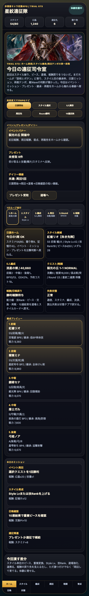
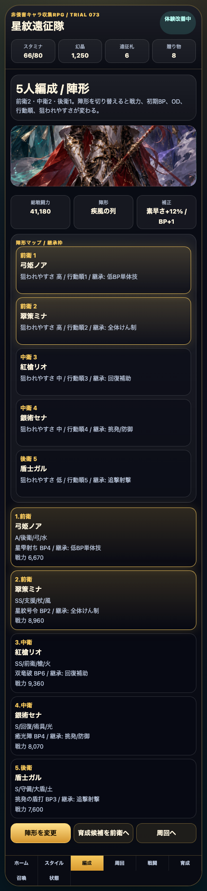
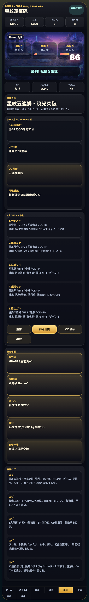

# SagaForge Trial 073：ホーム密度・継承枠・再戦テンポを足して「スマホRPGの日課」に寄せる

## 前回の何が期待体験から遠かったか

ユーザー評価の「全然ロマサガRSとは程遠い」は妥当だった。前回までにスタイル、5人編成、Round/BP/OD、報酬戻りは入ったが、まだ次の弱さが残っていた。

- ホームが説明とショートカット中心で、イベント、プレゼント、デイリー、ミッションが同じ画面で圧縮されるスマホRPGらしさが薄い。
- スタイルカードはあっても、同一キャラの別スタイルから技を持ち込むような「継承枠」の読み替えがなく、スタイル単位で悩む理由が弱い。
- クエスト勝利後の再戦、ミッション達成、報酬から道場へ戻る流れがまだ分断されていた。

今回も実在IP・公式素材・商標・ロゴ・キャラ・公式文言・公式確率・公式UIコピーは使わず、体験パターンだけを非侵害のオリジナルUIに寄せた。

## 今回潰した差分

Trial 073では、記事より先に `playables/sagaforge-app/index.html` を更新した。

1. **ホーム密度**
   ホームに「イベント/プレゼント/デイリー」「本日のミッション」を追加し、スタミナ、贈り物、日課開始、周回、道場、召喚確認が1分ループとして見えるようにした。

2. **スタイル継承枠**
   スタイルカードと編成カードに「継承: 低BP単体技」「継承: 全体けん制」などを表示した。まだ簡易表示だが、キャラ単体ではなくスタイル単位で採用理由を読む方向へ寄せた。

3. **クエスト/戦闘テンポ**
   クエスト詳細にミッション、戦力判定、再戦設定、周回戻り先を追加。戦闘には「ターン方針 / Wave判断」を追加し、BP判断、OD判断、再戦導線を画面上で確認できるようにした。

4. **触れる操作**
   「プレゼント受取」「5人陣形」「周回」「出撃」「OD号令」「再戦」を実際にクリックでき、数値とログが変わる状態を維持した。

## スクリーンショット

### ホーム：イベント/プレゼント/デイリーを追加



### 編成：陣形マップと継承枠を追加



### 戦闘：Round/BP/ODに加えてWave判断と再戦導線を追加



## 検証

今回の変更範囲では、静的プレイアブルの構文、プレビュー再生成、Playwright操作確認を行った。

```text
python3 scripts/build_preview.py
node -e "new Function(script)"
node scripts/capture-sagaforge-playable-trial073.mjs
```

結果：

```text
script syntax ok
captured trial073 screenshots from preview/sagaforge-app/index.html
```

保存した証跡：

- `experiments/character-collection-rpg-trial-001/artifacts/character-collection-rpg-trial-073/terminal/script-syntax.log`
- `experiments/character-collection-rpg-trial-001/artifacts/character-collection-rpg-trial-073/terminal/capture.log`
- `experiments/character-collection-rpg-trial-001/artifacts/character-collection-rpg-trial-073/screenshots/`

## まだ遠い点

- ホームの密度は増えたが、バナー演出、ログインボーナス、ミッション報酬受け取りの細かい状態遷移はまだ浅い。
- 継承枠は表示だけで、同一キャラ別スタイルから選んで入れ替える操作にはなっていない。
- 戦闘はBP/OD/連携/Wave判断が見えるようになったが、技ごとの個別選択、状態異常、回復判断、オート周回、リザルト演出はまだ足りない。
- ガチャは10連結果と重複ピース変換はあるが、演出段階の溜め、交換所、天井到達時の選択はまだ弱い。

## 次に潰す差分

次回は「同一キャラの複数スタイル」と「技継承の入れ替え」を最優先にする。具体的には、1人のキャラに複数スタイルを持たせ、継承技を選ぶとBP予約と戦闘ログが変わるところまで触れるようにしたい。

## 今回のAIDD-Spec学習

今回の教訓は、「見た目のRPG画面」ではなく「日課で何を判断して、どの報酬がどの育成に戻るか」を上流要求に書かないと、AIは一般的なファンタジーUIで止まりやすいということだ。AIDD Control Plane側では、次のようなチェック項目が必要になる。

| チェック項目 | 何を確認したいのか | なぜ必要か |
|---|---|---|
| ホーム密度 | イベント、ミッション、プレゼント、日課が同じ画面で判断できるか | スマホRPGの毎日起動する理由を作るため |
| スタイル単位 | レアリティ、ロール、武器、属性、Style Lv、技Rank、ピース、継承が見えるか | キャラ単体ではなくスタイル収集の遊びに近づけるため |
| 周回戻り | 勝利報酬が道場、スタイル、召喚、再戦に戻るか | 1戦だけのデモで終わらせないため |

## プレイアブル

プレビュー内の `sagaforge-app/index.html` で触れる。公開確認ではこのURLを使う。
