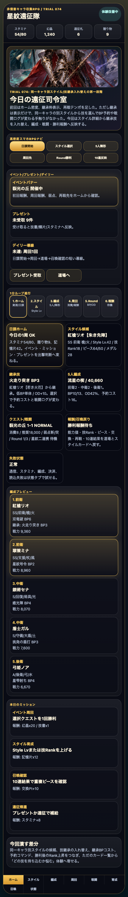
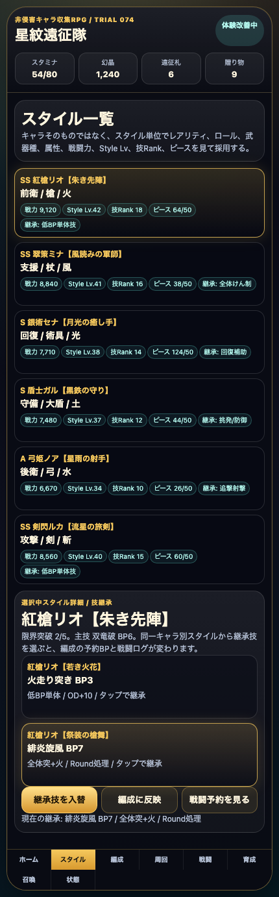
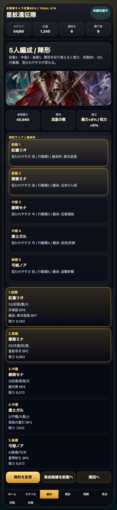
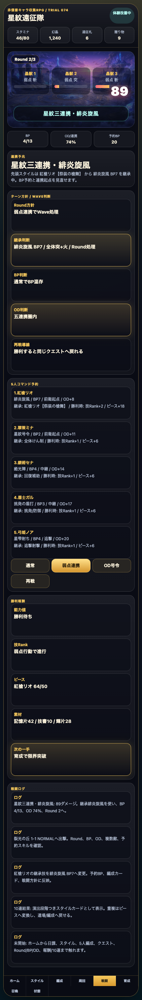

# SagaForge Trial 074：同一キャラ別スタイルと技継承の入れ替えを触れるようにする

## 前回の何がロマサガRS的な期待体験から遠かったか

ユーザー評価の「全然ロマサガRSとは程遠い」は、今回も正面から受け止める。星紋遠征隊は非侵害のオリジナルプロトタイプであり、実在IP・公式素材・商標・ロゴ・キャラ・公式文言・公式確率・公式UIの完全コピーは使わない。そのうえで、ユーザーが期待しているのは「一般的なファンタジーRPG」ではなく、スマホのキャラ収集RPGで毎日触る判断の連なりだ。

Trial 073でホーム密度、イベント/プレゼント/デイリー、継承枠表示、再戦導線を増やした。しかし、まだ次が弱かった。

- 継承枠が表示だけで、同一キャラの別スタイルから技を選ぶ操作になっていなかった。
- 技を入れ替えても、BP予約、編成カード、戦闘ログ、連携名が変わる体験になっていなかった。
- スタイル一覧が「カードを見る」止まりで、「どの技を持ち込むか悩む」スマホRPGらしい準備時間に届いていなかった。

## 今回どの差分を潰したか

Trial 074では記事より先に `playables/sagaforge-app/index.html` を更新し、触れるプレイアブル体験を改善した。

1. **同一キャラ別スタイルの候補を追加**
   - 例：紅槍リオに「若き火花」「祭装の槍舞」という独自名の別スタイル候補を置いた。
   - それぞれに継承技、BPコスト、効果説明を持たせた。

2. **技継承を入れ替える操作を追加**
   - スタイル詳細で「火走り突き BP3」と「緋炎旋風 BP7」をタップして切り替えられる。
   - 「継承技を入替」ボタンでも変更できる。

3. **継承結果を編成・戦闘へ反映**
   - 5人編成の先頭スタイルに「継承: 緋炎旋風 BP7」のように表示される。
   - 戦闘画面の予約BP、継承判断、コマンド予約、連携名が継承技に応じて変わる。
   - 弱点連携を押すと「星紋三連携・緋炎旋風」のようなログになる。

## スクリーンショット

### ホーム：今回の差分を明示



### スタイル詳細：同一キャラ別スタイルから継承技を選ぶ



### 編成：継承技が5人編成へ反映される



### 戦闘：BP/連携ログに継承技が出る



## 検証

今回の変更範囲では、静的プレイアブルのスクリプト構文、プレビュー再生成、Playwrightによる操作確認を行った。

```text
node scripts/check-sagaforge-playable-syntax-trial074.mjs
python3 scripts/build_preview.py
node scripts/capture-sagaforge-playable-trial074.mjs
```

結果：

```text
trial074 script syntax ok
Wrote 173 articles to preview
captured trial074 screenshots from preview/sagaforge-app/index.html
```

Playwright確認では、次の可視トークンを検査した。

- `継承判断`
- `緋炎旋風`
- `星紋三連携`

保存した証跡：

- `experiments/character-collection-rpg-trial-001/artifacts/character-collection-rpg-trial-074/terminal/build-preview.log`
- `experiments/character-collection-rpg-trial-001/artifacts/character-collection-rpg-trial-074/terminal/capture.log`
- `experiments/character-collection-rpg-trial-001/artifacts/character-collection-rpg-trial-074/screenshots/`

## まだ遠い点

- 同一キャラ別スタイルは候補データを入れた段階で、キャラ単位の一覧、所持/未所持、スタイル切替履歴まではない。
- 継承技は先頭スタイル中心で、5人全員の継承枠を個別に選ぶところまでは未実装。
- 戦闘は継承技の名前、BP、ログ、ダメージに反映されるが、技ごとの状態異常、回復判断、敵弱点別の最適化、AUTO周回判断はまだ浅い。
- ガチャで新スタイルを引いた後、そのスタイルから継承候補が増える導線はまだ弱い。

## 次に潰す差分

次回は「5人全員の技継承」と「召喚結果から継承候補が増える導線」を優先する。10連結果で得たスタイルが、単なる結果カードではなく、編成・継承・周回火力へ戻るところまで近づけたい。

## 今回のAIDD-Spec学習

今回の学習は、AIへの上流要求に「スタイルカードを出す」だけでは足りないということだ。必要なのは、次のように操作と検証まで書くことだった。

| チェック項目 | 何を確認したいのか | なぜ必要か |
|---|---|---|
| 同一キャラ別スタイル | 1キャラに複数スタイル候補があり、継承元として読めるか | キャラ収集RPGの判断が「キャラ名」ではなく「スタイル差」に出るため |
| 技継承操作 | 継承技をタップで入れ替えられるか | 表示だけではプレイ体験にならないため |
| 戦闘反映 | BP、予約コマンド、連携名、ログが継承技で変わるか | 準備画面の選択が戦闘テンポに返ってくる必要があるため |

## プレイアブル

プレビュー内の `sagaforge-app/index.html` で触れる。公開確認ではこのURLを使う。
