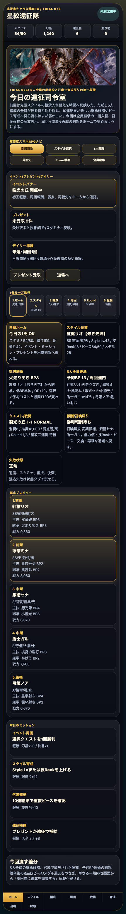
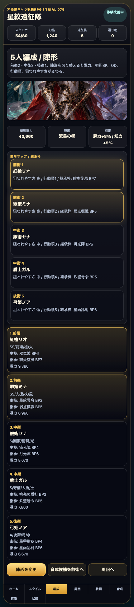
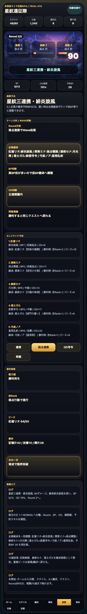
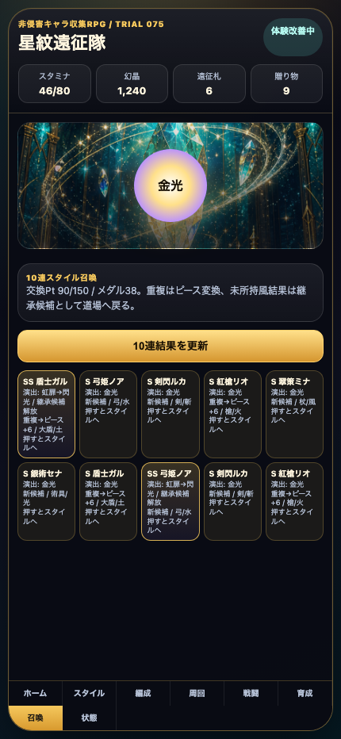

# SagaForge Trial 075：5人全員の技継承と召喚→育成戻りをプレイアブルに入れる

## 前回の何がロマサガRS的な期待体験から遠かったか

ユーザー評価の「全然ロマサガRSとは程遠い」は、今回も前提として受け止める。星紋遠征隊は非侵害のオリジナルプロトタイプであり、実在IP・公式素材・商標・ロゴ・キャラ・公式文言・公式確率・公式UIの完全コピーは使わない。そのうえで、期待されているのは一般的なファンタジーRPGではなく、キャラ収集RPGで毎日発生する「ホーム確認 → スタイル/継承選択 → 5人編成 → 周回 → 報酬 → 育成/召喚へ戻る」短い判断ループだ。

Trial 074では先頭スタイルの継承技を入れ替え、BP予約と戦闘ログへ反映した。しかし、まだ次が遠かった。

- 継承操作が先頭スタイル中心で、5人全員の持ち込み技を調整する手触りになっていなかった。
- 10連結果がスタイルカードとして表示されても、「継承候補が増えた」「重複ピースが育成へ戻る」という日課ループへの返りが弱かった。
- ホームでは情報密度は上がったが、予約BPが重い/軽い、周回圏内かどうかを読む判断がまだ薄かった。

## 今回どの差分を潰したか

今回は記事より先に `playables/sagaforge-app/index.html` を更新し、公開プレイアブルで触れる体験を改善した。

1. **5人全員の継承枠を表示**
   - 編成カードで前衛/中衛/後衛それぞれに「主技」と「継承」を出すようにした。
   - 戦闘のコマンド予約でも、5人それぞれの継承元・BP・役割を読める。

2. **全員継承の一括調整を追加**
   - ホームの高密度ナビに「全員継承」ボタンを追加。
   - 押すと5人分の継承候補が一括で入れ替わり、予約BPが再計算される。
   - 戦闘画面の「全員継承」「BP判断」へ反映される。

3. **召喚結果を育成/継承候補へ戻す表示を追加**
   - 10連結果のSS風カードに「継承候補解放」を表示。
   - 道場の「召喚候補解放」に解放済み候補を出し、重複ピース/交換Pt/メダルが育成導線へ戻ることを見せた。

4. **ホームの判断密度を少し上げた**
   - ホームカードに「5人全員継承」「予約BP」「周回圏内/重い」を追加。
   - 出撃前の小さな悩みが、単なる説明ではなく状態として読めるようになった。

## スクリーンショット

### ホーム：5人全員継承と予約BP判断を追加



### 編成：前衛/中衛/後衛それぞれに主技と継承技を表示



### 戦闘：全員継承、BP判断、コマンド予約がつながる



### 召喚：結果カードから継承候補解放とピース育成へ戻す



## 検証

今回の変更範囲では、静的プレイアブルのスクリプト構文、プレビュー再生成、Playwrightによる操作確認、公開URL確認を行った。

```text
node scripts/check-sagaforge-playable-syntax-trial075.mjs
python3 scripts/build_preview.py
node scripts/capture-sagaforge-playable-trial075.mjs
curl -I https://PUBLIC_PREVIEW_HOST/sagaforge-app/index.html
curl -I https://PUBLIC_PREVIEW_HOST/sagaforge-app/assets/party-key-art.png
```

Playwright確認では、次の可視トークンを検査した。

- `5人全員継承`
- `全員継承`
- `予約BP`
- `継承候補解放`

保存した証跡：

- `experiments/character-collection-rpg-trial-001/artifacts/character-collection-rpg-trial-075/terminal/`
- `experiments/character-collection-rpg-trial-001/artifacts/character-collection-rpg-trial-075/screenshots/`

## まだ遠い点

- 5人全員の継承枠は一括切替までで、各隊員を個別に選び、継承元スタイルを所持/未所持で絞るところまではない。
- ガチャ結果は「候補解放」として戻るが、実際に新しい技候補データを動的追加するところまでは浅い。
- 戦闘テンポはRound、BP、OD、複数敵、ログ、報酬を持つが、AUTO周回、敵弱点ごとの技選択、状態異常、回復判断はまだ簡略化されている。
- ホームは情報密度が増えたが、イベント一覧、ミッション、交換所、プレゼント、スタミナ回復を画面遷移で深掘りするには足りない。

## 次に潰す差分

次回は「個別隊員ごとの継承選択」と「ガチャで引いたスタイルが継承候補リストに追加される実データ化」を優先する。全員一括ではなく、前衛は低BP、後衛は全体技、支援は補助技というように、隊列と役割ごとの悩みをもっと出したい。

## 今回のAIDD-Spec学習

今回の学習は、AIへの上流要求で「5人編成」「ガチャ」「育成」と名詞だけを並べても、体験は近づかないということだ。必要なのは、どの画面の選択が次の画面の判断へ返るかを書くことだった。

| チェック項目 | 何を確認したいのか | なぜ必要か |
|---|---|---|
| 5人全員の継承 | 各隊員に主技と継承技があり、予約BPへ反映されるか | 編成が見た目だけでなく周回準備の判断になるため |
| 召喚から育成戻り | 結果カード、重複ピース、候補解放が道場/スタイルへ戻るか | ガチャが単発演出で終わらず育成ループに入るため |
| ホームの判断密度 | 予約BPや周回圏内かどうかがホームで読めるか | スマホRPGらしい日課の入口にするため |

## プレイアブル

プレビュー内の `sagaforge-app/index.html` で触れる。公開確認ではこのURLを使う。
